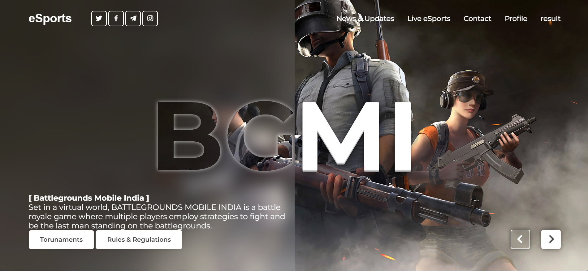
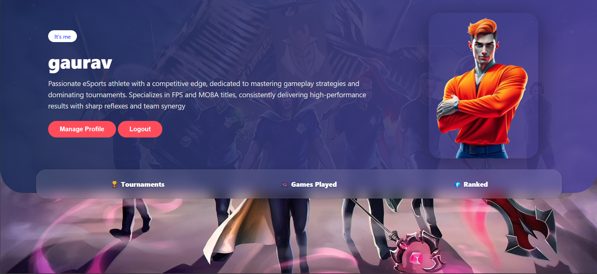
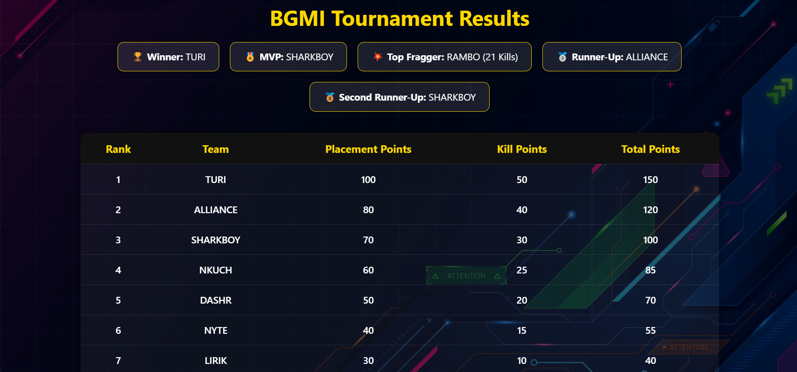
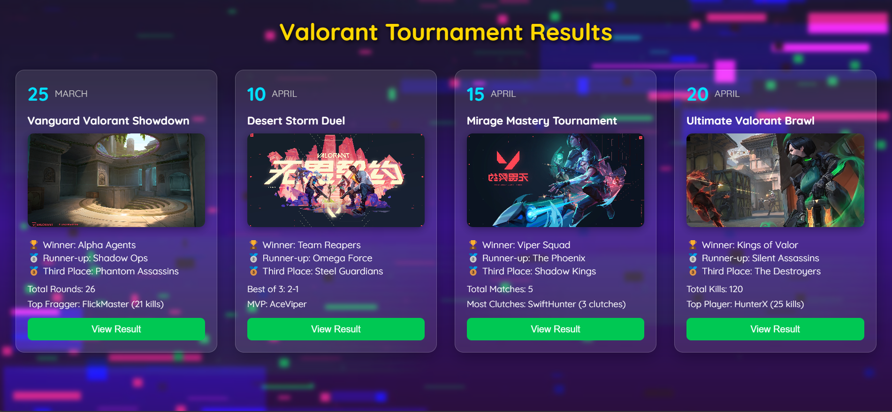

<!-- Banner -->
<p align="center">
  
</p>

<h1 align="center">🎮 Esports Hub – Competitive Gaming Tournament Platform</h1>

<p align="center">
  A full-stack platform for organizing and showcasing esports tournaments like BGMI, Valorant, and Clash of Clans.
</p>

<p align="center">
  <a href="#"></a>
  
  
</p>

---

## 📺 Demo

🌐 **Live Site**: _Coming Soon_  
📽️ **Demo Video**: _Add YouTube or Drive link here_

---

## ✨ Features

### 👤 User Features
- User **signup/login** system
- View **profile photo**, **rank**, and **tournament history**
- Join upcoming tournaments
- View match results in game-specific layouts

### 🏆 Tournament System
- Upcoming & past tournament display
- Winner & runner-up banners
- Styled results similar to in-game match summaries

### 📊 Results Pages
- **BGMI**: Squad vs Squad layout, MVPs, total kills
- **Valorant**: Round-wise stats, top fragger, agent picks
- **Clash of Clans**: Destruction %, stars, best attacker

---

## 🛠️ Tech Stack

| Category    | Technology        |
|-------------|-------------------|
| Frontend    | HTML, CSS, JavaScript |
| Backend     | PHP               |
| Database    | MySQL             |
| Dev Tools   | Git, GitHub, Postman |
| Hosting     | XAMPP / 000WebHost / InfinityFree |

---


---

## 🖼️ Screenshots

> Add your real images inside a `screenshots/` folder in the repo

### 🔹 Homepage


### 🔹 Profile Page


### 🔹 BGMI Results


### 🔹 Valorant Results


---

## 🚀 Installation

### 1. Clone the Repository
```bash
git clone https://github.com/your-username/esports-hub.git
cd esports-hub
```
⚙️ Setup Database
Create a MySQL database named esports_hub (or your chosen name).
Import the SQL schema located in database/schema.sql (or your schema file).

🛠 Configure Database Connection
Update the database configuration in config.php (or wherever your DB config is) with your credentials:
```bash
<?php
define('DB_HOST', 'localhost');
define('DB_USER', 'root');
define('DB_PASS', 'yourpassword');
define('DB_NAME', 'esports_hub');
?>
```
📥 Start Development Server
You can run the project locally using XAMPP, WAMP, or any PHP-enabled web server:
Place the project folder in the webserver root directory (e.g., htdocs for XAMPP).
Start Apache and MySQL services.
Access via browser: http://localhost/esports-hub

🖥️ How to Use
Register a new account or login.
Update your profile with a photo and stats.
Browse upcoming tournaments and register.
View results and leaderboard for completed tournaments.
Manage your participation and past matches.

📁 Folder Structure
```bash
esports-hub/
│
├── assets/               # Images, CSS, JS files  
├── includes/             # PHP include files (header, footer, DB config)  
├── pages/                # Web pages (profile, tournaments, results)  
├── api/                  # API endpoints (if any)  
├── database/             # SQL schema and seed data  
├── index.php             # Main entry point  
├── config.php            # Configuration settings  
├── README.md             # Documentation  
└── .gitignore            # Git ignore rules  

```
🔧 Testing
Use the browser to navigate through features.
Test user registration, tournament creation, joining, and results.

✨ Future Enhancements
Add real-time match updates using WebSocket
Integrate payment gateway for tournament fees
Add player rankings and stats analytics
Mobile app companion

🤝 Contributing
Feel free to open issues or submit pull requests.

📄 License
This project is licensed under the MIT License.

📬 Contact
Created by Gaurav More
📧 gauravmore33444@gmail.com
